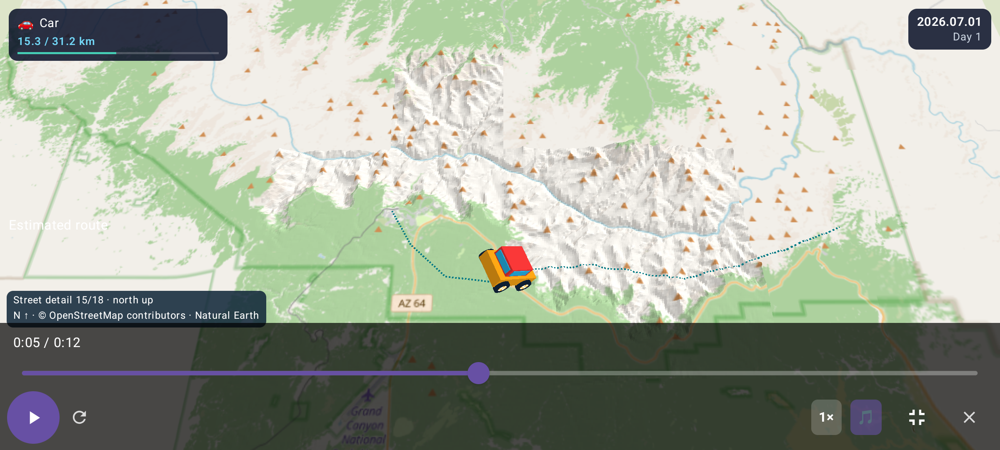
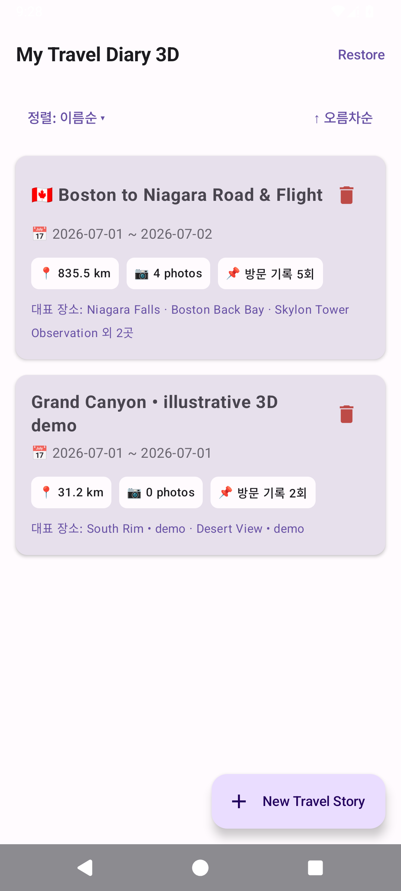
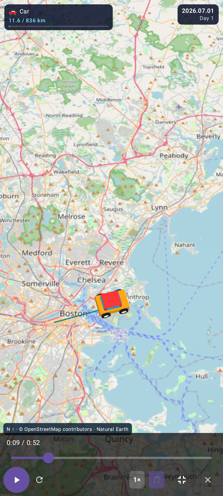
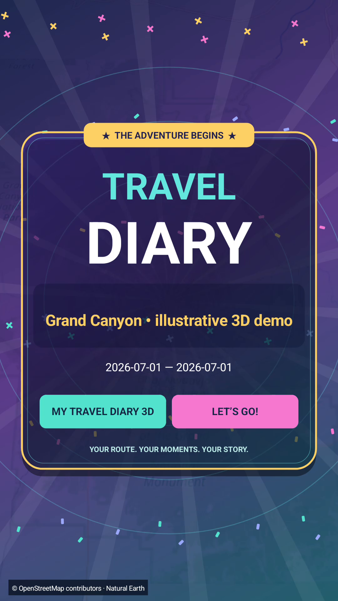

# My Travel Diary 3D

### 다녀온 길 위에서, 여행이 다시 시작됩니다.

어디를 지나갔는지, 그곳에서 어떤 사진을 찍었는지. **My Travel Diary 3D**는 Google 지도 타임라인의 이동 기록과 휴대폰 사진을 모아, **움직이는 3D 여행 일기와 공유할 수 있는 영상**으로 만들어 주는 Android 앱입니다.

산길을 오르는 작은 자동차, 하늘을 가로지르는 비행기, 잠시 멈춰 감상하는 여행 사진. 여행의 순간들을 지도 위에서 다시 만나 보세요.

**[📥 Android 앱 다운로드](https://github.com/HyeokjaeKwon26/My-Travel-Diary-3D/releases/tag/v1.0.0-rc11)** · **[처음 사용하는 분을 위한 안내](docs/INSTALLATION_3D.md)** · **[문제·의견 보내기](https://github.com/HyeokjaeKwon26/My-Travel-Diary-3D/issues)**

Android 8.0 이상 · 휴대폰·태블릿 · 현재 공개 버전 **1.0.0-rc11 (시험 배포)**

*앱에서 재생한 그랜드 캐니언 예시입니다. 실제 지형을 사용하며, 경로는 체험용으로 구성했습니다.*

## 이런 여행 기록을 만들 수 있어요

- **이동하는 순간까지 생생하게.** 자동차·기차·비행기·배 등 이동수단이 입체 캐릭터로 등장합니다. 산길의 오르내림과 통통 튀는 움직임이 여행에 재미를 더합니다.
- **사진과 장소를 함께 기억하세요.** 날짜별 방문 기록과 사진을 한곳에 모읍니다. 사진은 원래 비율로 보여 주고, 이동 중 찍은 사진이 나오면 경로 재생이 잠시 멈춰 감상할 시간을 줍니다.
- **대표 사진은 자동으로, 마음에 드는 사진은 직접.** 사진을 분석해 여행의 장면을 고르고, 직접 대표 사진을 지정할 수도 있습니다. 선택 결과를 저장하므로 여행을 다시 열 때마다 처음부터 고르지 않습니다.
- **크게 보고, 원하는 순간으로 이동하세요.** 전체화면과 가로보기를 지원합니다. 현재 시간·전체 재생 시간을 보면서 원하는 지점으로 이동하거나 재생 속도를 바꿀 수 있습니다.
- **여행을 한 편의 영상으로.** 화려한 시작·마무리 화면, 이동 경로, 사진, 선택 가능한 배경음악을 담은 MP4를 만듭니다. 세로·가로 영상을 저장하고 가족이나 친구에게 공유하세요.
- **쌓이는 여행도 찾기 쉽게.** 여행 이름·만든 순서·여행 날짜로 정렬하고, 여행별 거리·사진 수·방문 기록을 한눈에 확인합니다.

## 실제 화면으로 미리 보기

| 여행을 모아 보는 첫 화면 | 지도 위에서 즐기는 전체화면 | 완성된 여행 영상의 표지 |
| :---: | :---: | :---: |
|  |  |  |

*예시 여행 데이터를 사용한 실제 앱 화면과 저장된 영상의 한 장면입니다. 화면 구성과 글꼴은 기기 설정에 따라 달라질 수 있습니다.*

## 먼저, 예시 여행부터 즐겨 보세요

개인 위치 기록이나 사진을 준비하지 않아도 됩니다.

1. 앱을 설치하고 **+ New Travel Story**를 누릅니다.
2. **Try Grand Canyon 3D • illustrative route**를 선택합니다.
3. 여행 화면의 **지도 재생 버튼 ▶**을 눌러 출발하세요. 재생 막대의 전체화면 버튼으로 더 크게 볼 수 있습니다.

## 내 여행 만들기 → 재생하기 → 영상으로 간직하기

### 1. 여행 기록과 날짜를 선택하세요

Google 지도 타임라인에서 내보낸 **JSON 파일**과 여행 중 찍은 **휴대폰 사진**을 준비합니다. JSON은 이동 기록이 담긴 파일로, 직접 열거나 편집할 필요는 없습니다.

**+ New Travel Story → Choose Timeline JSON File**에서 파일을 고른 뒤, 여행 이름을 적고 달력에서 시작일과 마지막 날을 선택합니다. 사진 접근 권한을 허용하고 **Reconstruct Travel Story**를 누르면 여행 일기를 만듭니다. 준비 중에는 진행률과 예상 남은 시간을 확인할 수 있습니다.

### 2. 경로를 따라 추억을 돌아보세요

여행 카드를 열고 지도에서 재생 버튼을 누르세요. 지도는 북쪽을 위로 유지하며 이동 위치를 따라가고, 경로에 맞춰 배율을 자동으로 조절합니다. 날짜와 여행 며칠째인지도 함께 표시합니다.

사진을 눌러 크게 살펴보고 **Use as Representative Photo**로 마음에 드는 사진을 지정하세요. **사진 다시 고르기**를 누르면 자동 선택을 새로 진행할 수 있습니다.

### 3. 원하는 모양의 영상을 만드세요

여행 **제목 오른쪽의 ▶ 버튼**을 누르면 영상 만들기 창이 열립니다. 지도 안의 재생 버튼과는 위치가 다릅니다.

영상 길이, 세로·가로 방향, 화질과 음악을 선택하고 **Create Travel Video**를 누르세요. 완성되면 **Play Preview**로 확인하고 **Save Video**로 사진첩에 저장하거나 **Share**로 공유할 수 있습니다.

| 이런 용도라면 | 추천 설정 |
| --- | --- |
| 휴대폰에서 세로로 감상하거나 공유하기 | Portrait 9:16 |
| 태블릿이나 넓은 화면에서 감상하기 | Landscape 16:9 |
| 처음 만들어 보기 | Standard Story + 720p |
| 더 선명하게 간직하기 | 1080p — 기기에 따라 720p로 조정될 수 있습니다 |

**[설치, 사진 선택, 지도 설정, 백업까지 자세히 보기 →](docs/INSTALLATION_3D.md)**

## 자주 묻는 질문

**원본 사진을 지워도 여행에서 볼 수 있나요?**

아직은 원본 사진을 보관해야 합니다. 앱은 어떤 사진을 보여 줄지 저장하지만 사진 파일을 별도로 복사하지는 않습니다. 원본을 삭제하면 여행에서 해당 사진을 볼 수 없습니다. 이미 사진첩에 저장한 MP4에는 사진이 담겨 있어 원본을 삭제해도 재생됩니다.

**인터넷이 꼭 필요한가요?**

기본 지도는 앱에 들어 있습니다. 처음 보는 지역의 상세 도로·지명과 지형을 준비할 때는 인터넷이 필요합니다. 저장된 지도·지형은 재사용하지만, 전 세계 상세 지도가 모두 포함된 것은 아닙니다. 영상은 휴대폰에 준비된 지도를 사용하며, 상세 지도가 없는 곳은 기본 지도로 표시합니다.

**휴대폰과 태블릿에서 모두 쓸 수 있나요?**

Android 휴대폰과 태블릿의 화면 크기에 맞춰 구성을 조절합니다. 앱 재생과 완성된 영상 모두 전체화면·가로보기를 지원합니다. 현재는 시험 배포 단계로, 기기마다 재생 성능과 영상 생성 시간이 다를 수 있습니다. iPhone용 앱은 제공하지 않습니다.

**사진과 위치 기록이 서버에 올라가나요?**

여행 기록과 사진 분석, 영상 만들기는 휴대폰에서 처리하며 사진 원본이나 타임라인 파일을 업로드하지 않습니다. 지도·지형을 불러오는 통신과 사진 분석 도구의 사용 진단 정보 전송은 있을 수 있습니다. [개인정보 안내](docs/PRIVACY_3D.md)를 확인해 주세요.

---

### 더 알아보기

**[설치·사용 안내](docs/INSTALLATION_3D.md)** · **[다운로드와 버전 소식](https://github.com/HyeokjaeKwon26/My-Travel-Diary-3D/releases)** · **[문제·의견 보내기](https://github.com/HyeokjaeKwon26/My-Travel-Diary-3D/issues)**

[My Travel Diary](https://github.com/HyeokjaeKwon26/My-Travel-Diary)를 바탕으로 만든 별도의 3D 앱입니다. 기존 앱과 함께 설치할 수 있습니다. 지도: © [OpenStreetMap contributors](https://www.openstreetmap.org/copyright), Natural Earth. 지형·음악 출처와 라이선스: [지형](docs/TERRAIN_PACKS.md) · [음악](docs/MUSIC_LICENSES.md) · [AGPL-3.0](LICENSE).

개발에 참여하거나 기술 정보를 찾는 분은 **[개발자 문서](docs/DEVELOPMENT.md)**를 참고해 주세요.
