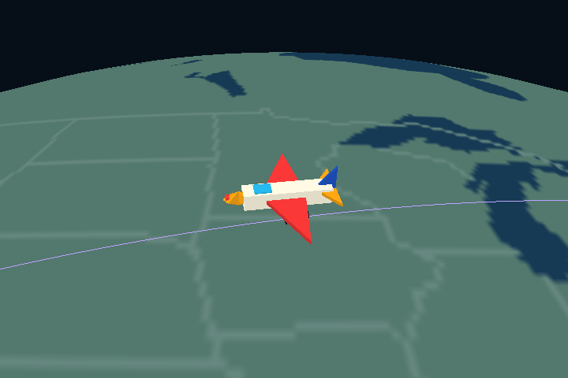
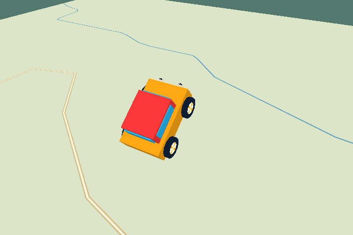
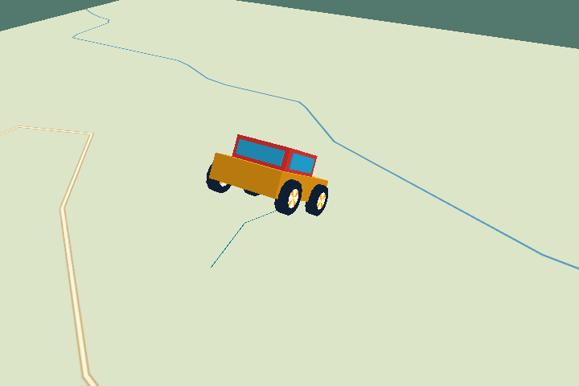
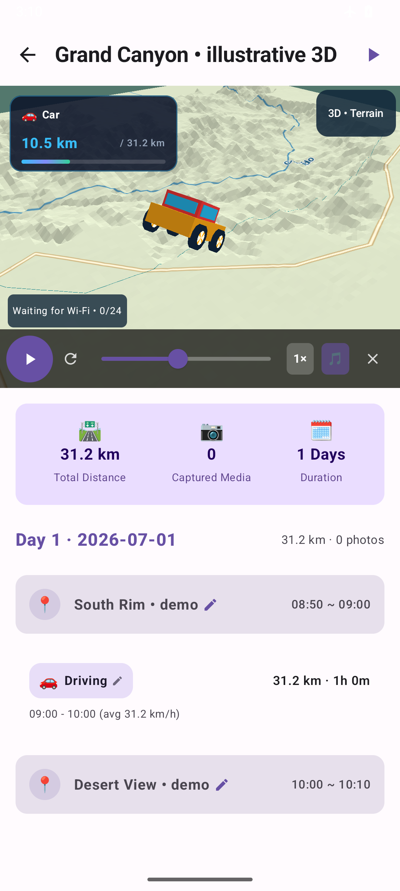

# My Travel Diary 3D

An independent Android 3D edition of [My Travel Diary](https://github.com/HyeokjaeKwon26/My-Travel-Diary), based on original commit `9bcfb4f`.

**Version: 1.0.0-rc3.** Larger animated toy vehicles, corrected globe-following flights, offline cartography over 3D terrain, and signed installation builds. Physical-device acceptance is pending; Galaxy S23 Ultra is the primary target. See [validation and remaining work](docs/PRODUCTION_STATUS.md).

## 한국어

Google Timeline JSON과 휴대폰 사진을 여행 다이어리로 구성하고, 지구본과 간단한 실제 지형 위에서 이동을 3D로 재생하는 Android 앱입니다. 여행 파일과 사진은 휴대폰에서 처리합니다. 필요한 지형은 Wi-Fi에서 자동 준비하며 저장 후 오프라인으로 재생할 수 있습니다.

- 앱 이름: **My Travel Diary 3D**
- 별도 앱 ID: `com.traveler.threed` — 기존 앱과 함께 설치할 수 있습니다.
- 기존 앱의 저장소·설치 데이터는 변경하지 않습니다. 기존 여행이 자동 복사되지는 않으므로 Timeline 파일을 새 앱에서 가져와 주세요.
- Android 8.0 이상을 대상으로 빌드합니다. 실제 지원 성능은 기기 검증이 더 필요합니다.

### 이번 버전

- 자동차·버스·기차·지하철·비행기·배·자전거·걷기·달리기를 크게 과장한 입체 장난감으로 표시합니다.
- 오르막/내리막의 기울기, 통통 튀는 차체, 회전하는 바퀴, 걷기/달리기/페달 동작과 비행기·배의 흔들림을 추가했습니다.
- 긴 비행이 지구 안으로 들어가던 계산을 수정하고, 북쪽 고정 카메라에서도 기체는 경로 진행 방향을 향합니다.
- 과장된 움직임은 화면과 저장 영상의 연출에만 적용되며 원래 위치·고도 기록은 변경하지 않습니다.

- 갈색 지형이 지도를 가리던 문제 수정: 지형 위에 해안선·강·주요 도로·도시 영역·지명을 표시. 지도 좌우 반전도 수정.
- 기본 지도는 APK에 포함되어 고도 다운로드 전이나 오프라인에서도 표시됩니다. 모든 골목길을 포함한 내비게이션 지도는 아닙니다.
- OpenGL ES 2.0 지구본, 지역 지형, 이동수단별 입체 모델과 추적 카메라.
- 실제 공개 고도 데이터로 만든 **Grand Canyon South Rim** 오프라인 지형 팩.
- 지상 이동 경로 주변 지형 자동 다운로드, 일시정지·재개, 모바일 데이터 선택.
- 기본 200 MB 캐시(100/200/500 MB 선택), 여행별 오프라인 유지와 임시 지형 정리.
- 화면 주변 최대 12개 지형 메쉬, 부하·발열에 따른 내부 해상도 조절, 고정 북쪽 카메라와 2D 전환.
- 1080p/720p 선택, 2.9 MB 압축 음악의 스트리밍 디코딩.
- 여행 JSON 백업·복원(원본 사진 파일 및 지형 캐시는 미포함).
- 지도와 재생에서 경로 준비를 공유하고, 표시 전용 직선 연결·근거 없는 이동 구간 자동 생성을 제거.
- 재생 중 미래 경로를 숨기고 과거 경로를 흐리게 표시하여 왕복 경로 혼동을 줄임.
- 원래 고도와 시간별 좌표 보존, 단일 고도 이상치 필터, 급격한 고도 불연속 표시.
- 같은 3D 렌더러를 사용하는 H.264 MP4 출력과 선택적 AAC 음악.
- 영상 저장 오류·취소 처리, 사진 캐시 상한, 주소 일반화 옵션 적용.

### 바로 체험하기

1. APK를 설치하고 **+ New Travel Story**를 누릅니다.
2. **Try Grand Canyon 3D • illustrative route**를 누릅니다. 개인 위치 기록 없이 예제를 볼 수 있습니다.
3. 여행 지도에서 재생 버튼을 누르거나 전체 화면으로 엽니다.
4. **3D • Terrain**에서 카메라·2D 전환·지형 팩을 설정합니다.
5. 실제 여행은 새 여행 화면에서 Timeline JSON과 날짜를 선택하여 가져옵니다.

예제 경로는 연출 확인용이며 실제 GPS 기록이나 도로에 맞춘 경로가 아닙니다. 지형은 실제 고도 샘플을 사용합니다.

### 현재 한계

- 아직 다운로드하지 않은 지역에는 상세 지형이 없습니다. 준비 상태와 재시도 버튼이 표시됩니다.
- 긴 여행은 상세도를 낮추며 최대 256개 타일로 제한합니다. 초대형 범위와 극지방은 날짜/지역을 나눠야 합니다.
- 고도가 없는 비행의 상승 곡선은 시각적 연출이며 측정 고도가 아닙니다.
- DEM은 지면 높이입니다. 다리·터널·절벽 가장자리의 GPS 오차를 정확한 도로 높이로 복원하지 않습니다.
- 일반 스마트폰의 30fps, 발열, 10분 지속 재생은 아직 실기기 검증 전입니다.
- 사용자가 보고한 두 줄 현상은 실제 자료를 받지 않아 해당 사례의 해결 여부를 확정하지 않았습니다.
- 전 세계 도로 매칭, 다리·터널 고도 편집, 구간 전환 카메라의 추가 개선은 남아 있습니다.
- 주소 일반화는 장소 이름에 대한 보수적인 필터입니다. 사진 속 주소나 지도 경로를 익명화하지 않습니다.

상세한 구현 범위와 검증 기록: [구현 상태](docs/IMPLEMENTATION_STATUS.md) · [개발 계획](docs/3D_TRAVEL_ROADMAP.md) · [지형 팩 형식](docs/TERRAIN_PACKS.md).

## Preview

Actual GLES frames: large toy vehicles following a flight and synthetic uphill/downhill routes, plus mapped terrain in the signed app.






## Build and validation

Requires JDK 17 and Android SDK platform 36. Open in Android Studio or run:

```sh
./gradlew testDebugUnitTest assembleDebug lintDebug
# With an Android emulator/device connected:
./gradlew connectedDebugAndroidTest -Pandroid.testInstrumentationRunnerArguments.class=com.traveler.feature.map.ThreeDIntegrationTest,com.traveler.core.database.RoomMigrationAndroidTest,com.traveler.feature.video.TravelVideoExportAndroidTest
```

On Windows use `gradlew.bat`. Debug APK: `app/build/outputs/apk/debug/app-debug.apk`. Signed release setup: [installation and signing](docs/INSTALLATION_3D.md).
GitHub Actions builds an APK and uploads the unit-test/lint reports for pushes and pull requests.

The instrumentation suite checks an actual GLES frame, exports and decodes an MP4, tests audio/cancellation/gallery storage, and verifies Room migration and altitude persistence. It is not a physical-device performance benchmark.

## Data and license

AGPL-3.0; original attribution/history retained. Natural Earth provides the public-domain world polygons. The bundled US terrain is derived from Mapzen Terrain Tiles / USGS sources; see [terrain attribution and source manifests](docs/TERRAIN_PACKS.md). The app fetches public elevation tiles from AWS; tile regions and IP addresses are visible to that provider. Timeline JSON and photos are not uploaded. Source credits are bundled and readable offline from the terrain dialog. See [privacy](docs/PRIVACY_3D.md).

Historical documents and screenshots inherited from the original project describe the original 2D edition; they are not evidence of this edition’s features or performance.
