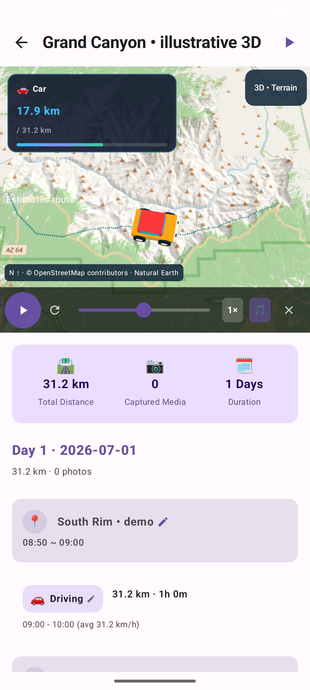
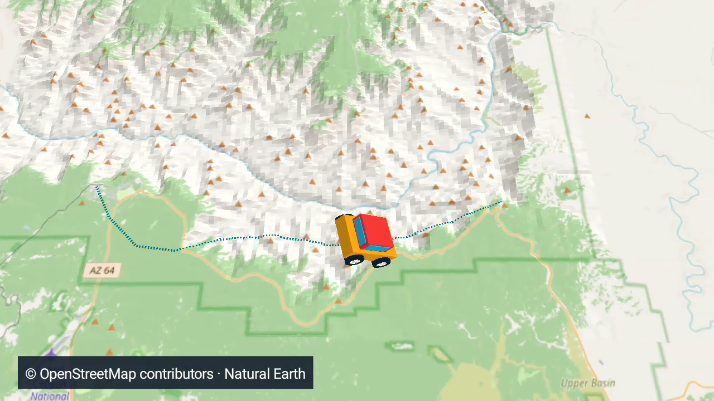
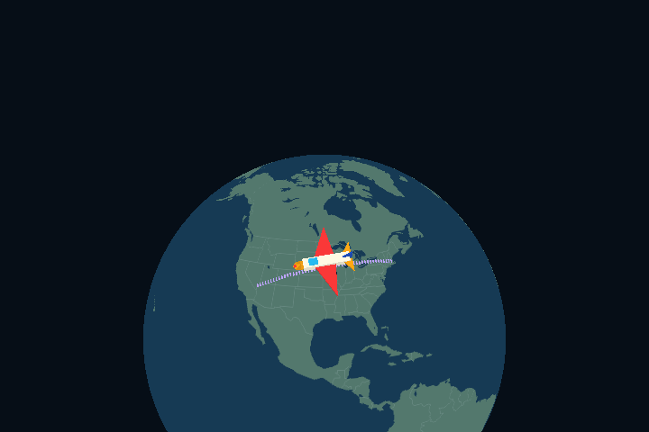

# My Travel Diary 3D

An independent Android 3D edition of [My Travel Diary](https://github.com/HyeokjaeKwon26/My-Travel-Diary), based on original commit `9bcfb4f`.

**Version: 1.0.0-rc9.** Accurate recorded-visit summaries, compact playback overlays, non-blocking background map preparation, bounded 2D drawing, automatic north-up route framing, adaptive phone/tablet layouts, calendar dates, local visual photo selection, and portrait/landscape video creation and playback. Physical-device acceptance is pending; Galaxy S23 Ultra is the primary target. See [validation and remaining work](docs/PRODUCTION_STATUS.md).

## 한국어

Google Timeline JSON과 휴대폰 사진을 여행 다이어리로 구성하고, 지구본과 간단한 실제 지형 위에서 이동을 3D로 재생하는 Android 앱입니다. 여행 파일과 사진은 휴대폰에서 처리합니다. 필요한 지형은 Wi-Fi에서 자동 준비하며 저장 후 오프라인으로 재생할 수 있습니다.

- 앱 이름: **My Travel Diary 3D**
- 별도 앱 ID: `com.traveler.threed` — 기존 앱과 함께 설치할 수 있습니다.
- 기존 앱의 저장소·설치 데이터는 변경하지 않습니다. 기존 여행이 자동 복사되지는 않으므로 Timeline 파일을 새 앱에서 가져와 주세요.
- Android 8.0 이상을 대상으로 빌드합니다. 실제 지원 성능은 기기 검증이 더 필요합니다.

### 이번 버전

- 이름 없는 방문은 기존 오프라인 도시·관광지 목록과 좌표를 비교해 `Boston 인근`처럼 보완합니다. 가까운 지역을 뜻하며 해당 관광지 방문을 확정하지 않습니다. 추가 다운로드나 위치의 서버 전송 없이 기존 여행에도 적용됩니다.
- 대표 지역은 중복을 묶고 직접 수정한 이름·기록된 이름을 우선한 뒤, 체류시간·사진 수·방문 날짜 분포로 고릅니다. 지명 목록에서 멀리 떨어진 방문은 미확인으로 남깁니다.

### 최근 카드 개선

- 여행 카드의 `places`를 `방문 기록 N회`로 바꿨습니다. 이름 없는 방문과 재방문을 포함하고, 여러 날짜에 걸친 같은 방문은 한 번만 셉니다. 기존 여행도 다시 가져올 필요 없이 적용됩니다.
- `대표 장소`는 저장되거나 직접 수정한 이름을 최대 3개와 나머지 개수로 표시합니다. 좌표에서도 주변 지역을 찾지 못하면 미확인 방문 수를 표시하고, 표시할 이름이 전혀 없을 때 `장소 이름 정보 부족`으로 표시합니다. 기록에 없는 장소를 추정하거나 도시 수로 해석하지 않습니다.
- 카드의 거리·사진·방문 배지는 좁은 화면이나 큰 글꼴에서 자동 줄바꿈합니다.

### 유지되는 기능

- 재생 정보 창을 작은 이동수단·거리 표시와 얇은 진행 막대로 줄였습니다. 실제 날짜와 여행 일차를 재생·일시정지·탐색 중 계속 표시합니다.
- 지도 위의 `3D • Terrain` / `2D • Options` 카드를 제거했습니다. 기존 지도 설정과 2D 전환은 여행 제목 옆 설정 버튼에서 열 수 있습니다.
- 앱과 영상에서 사진을 자르지 않고 원본 비율대로 축소합니다. 세로·가로·파노라마 사진의 전체 구도를 유지합니다.
- 날짜 선택창의 확인 버튼이 제스처·3버튼 내비게이션에 겹치지 않도록 시스템 영역을 확보했습니다.

- 북쪽을 위로 고정하고 경로 길이·화면 비율에 맞춰 자동 배율을 계산합니다. 수동 배율·핀치 줌은 사용하지 않습니다. 캐릭터를 줄이고 경로 선의 화면상 굵기를 유지합니다.
- 긴 구간은 더 천천히, 더 넓게 보여주며 시작·끝에는 전체 경로를 보여줍니다. 화면과 영상이 같은 카메라 계산을 사용합니다.
- 좁은 화면은 지도 위/일지 아래, 넓은 화면은 지도·일지를 나란히 표시합니다. 회전과 창 크기 변경에도 재생 화면을 유지합니다.
- 날짜는 달력에서 범위로 선택합니다. 여행 생성은 처리 단계·건수·가중 진행률·예상 남은 시간을 표시하며 취소할 수 있습니다.
- 사진 썸네일의 유사도·선명도·노출·장면 종류를 휴대폰에서 분석하고 결과를 캐시합니다. 사진의 개인적 중요도를 보장하지는 않으며 직접 고른 사진을 우선합니다.
- 세로 9:16/가로 16:9, 1080p/720p 영상을 생성하고 앱 내 플레이어에서 회전·전체화면으로 볼 수 있습니다. 원래 영상 비율을 유지합니다.
- 현재 화면의 OpenStreetMap 도로·지명을 3D 지형에 표시합니다. 처음 보는 지역은 인터넷이 필요하며 Wi-Fi/모바일 데이터 사용을 지도 옵션에서 끌 수 있습니다.
- 지도 로딩 중에도 사진·이동·음악은 계속 재생합니다. 새 지도는 별도 스레드에서 준비하고 기존 화면을 유지하다 교체합니다. 2D 지도는 재생 영역 밖으로 그려지지 않습니다. 긴 비행 구간의 경로선도 캐릭터와 같은 지구 곡면 보간을 사용합니다. 상세 지도 캐시는 최대 96 MiB입니다. 지형 캐시와 별도이며, 경로 전체를 미리 다운로드하거나 오프라인 지도 팩을 만들지 않습니다. 영상 생성 전에 이미 불러온 지도를 별도로 고정해 사용하며 없는 부분은 기본 지도로 표시합니다. 임시 복사본은 최대 96 MiB이며 완료·취소 후 삭제합니다.

- 자동차·버스·기차·지하철·비행기·배·자전거·걷기·달리기를 크게 과장한 입체 장난감으로 표시합니다.
- 오르막/내리막의 기울기, 통통 튀는 차체, 회전하는 바퀴, 걷기/달리기/페달 동작과 비행기·배의 흔들림을 추가했습니다.
- 긴 비행이 지구 안으로 들어가던 계산을 수정하고, 북쪽 고정 카메라에서도 기체는 경로 진행 방향을 향합니다.
- 과장된 움직임은 화면과 저장 영상의 연출에만 적용되며 원래 위치·고도 기록은 변경하지 않습니다.

- 갈색 지형이 지도를 가리던 문제 수정: 지형 위에 해안선·강·주요 도로·도시 영역·지명을 표시. 지도 좌우 반전도 수정.
- 기본 지역 지도는 APK에 포함되어 고도 다운로드 전이나 오프라인에서도 표시됩니다. 상세 도로·지명은 인터넷으로 보완합니다. GPS 경로를 도로에 맞추는 내비게이션/도로 매칭 기능은 아닙니다.
- OpenGL ES 2.0 지구본, 지역 지형, 이동수단별 입체 모델과 추적 카메라.
- 실제 공개 고도 데이터로 만든 **Grand Canyon South Rim** 오프라인 지형 팩.
- 지상 이동 경로 주변 지형 자동 다운로드, 일시정지·재개, 모바일 데이터 선택.
- 기본 200 MB 캐시(100/200/500 MB 선택), 여행별 오프라인 유지와 임시 지형 정리.
- 화면 주변 최대 12개 지형 메쉬, 부하·발열에 따른 내부 해상도 조절, 고정 북쪽 카메라와 2D 전환.
- 1080p/720p 선택, 2.9 MB 압축 음악의 스트리밍 디코딩.
- 여행 JSON 백업·복원(원본 사진 파일 및 지형 캐시는 미포함).
- 기록이 없는 시간 간격은 표시 전용 점선으로 연결합니다. 이동수단은 미상으로 두며 원본 기록·총 이동거리에 합산하지 않습니다. 고도 누락은 높이를 보간하며 수평 경로를 숨기지 않습니다.
- 재생 중 미래 경로를 숨기고 과거 경로를 흐리게 표시하여 왕복 경로 혼동을 줄임.
- 원래 고도와 시간별 좌표 보존, 단일 고도 이상치 필터, 급격한 고도 불연속 표시.
- 같은 3D 렌더러를 사용하는 H.264 MP4 출력과 선택적 AAC 음악.
- 영상 저장 오류·취소 처리, 사진 캐시 상한, 주소 일반화 옵션 적용.

### 바로 체험하기

1. APK를 설치하고 **+ New Travel Story**를 누릅니다.
2. **Try Grand Canyon 3D • illustrative route**를 누릅니다. 개인 위치 기록 없이 예제를 볼 수 있습니다.
3. 여행 지도에서 재생 버튼을 누르거나 전체 화면으로 엽니다.
4. 여행 제목 옆 **설정 버튼**에서 2D 전환·지형 팩·상세 지도 사용을 설정합니다.
5. 실제 여행은 새 여행 화면에서 Timeline JSON과 날짜를 선택하여 가져옵니다.

예제 경로는 연출 확인용이며 실제 GPS 기록이나 도로에 맞춘 경로가 아닙니다. 지형은 실제 고도 샘플을 사용합니다.

### 현재 한계

- 아직 다운로드하지 않은 지역에는 상세 지형이 없습니다. 준비 상태와 재시도 버튼이 표시됩니다.
- 긴 여행은 상세도를 낮추며 최대 256개 타일로 제한합니다. 초대형 범위와 극지방은 날짜/지역을 나눠야 합니다.
- 고도가 없는 비행의 상승 곡선은 시각적 연출이며 측정 고도가 아닙니다.
- DEM은 지면 높이입니다. 다리·터널·절벽 가장자리의 GPS 오차를 정확한 도로 높이로 복원하지 않습니다.
- 일반 스마트폰의 30fps, 발열, 10분 지속 재생은 아직 실기기 검증 전입니다.
- 사용자가 보고한 두 줄 현상은 실제 자료를 받지 않아 해당 사례의 해결 여부를 확정하지 않았습니다.
- 전 세계 도로 매칭, 다리·터널 고도 편집, 이동수단 전환 카메라의 추가 개선은 남아 있습니다.
- 주소 일반화는 장소 이름에 대한 보수적인 필터입니다. 사진 속 주소나 지도 경로를 익명화하지 않습니다.

상세한 구현 범위와 검증 기록: [구현 상태](docs/IMPLEMENTATION_STATUS.md) · [개발 계획](docs/3D_TRAVEL_ROADMAP.md) · [지형 팩 형식](docs/TERRAIN_PACKS.md).

## Preview

RC5 north-up playback and a landscape video frame. The Canyon example is illustrative, not road matched; cached street detail and public elevation data provide context.




Continental flights use the globe view without overlapping regional-map meshes.



## Build and validation

Requires JDK 17 and Android SDK platform 36. Open in Android Studio or run:

```sh
./gradlew testDebugUnitTest assembleDebug lintDebug
# With an Android emulator/device connected:
./gradlew connectedDebugAndroidTest -Pandroid.testInstrumentationRunnerArguments.class=com.traveler.feature.ui.AdaptiveJourneyAndroidTest,com.traveler.feature.map.ThreeDIntegrationTest,com.traveler.feature.map.StreetMapAndroidTest,com.traveler.feature.map.MapDrapeAndroidTest,com.traveler.feature.map.ToyVehicleAndroidTest,com.traveler.feature.video.TravelVideoExportAndroidTest
```

On Windows use `gradlew.bat`. Debug APK: `app/build/outputs/apk/debug/app-debug.apk`. Signed release setup: [installation and signing](docs/INSTALLATION_3D.md).
GitHub Actions builds an APK and uploads the unit-test/lint reports for pushes and pull requests.

The instrumentation suite checks an actual GLES frame, exports and decodes an MP4, tests audio/cancellation/gallery storage, and verifies Room migration and altitude persistence. It is not a physical-device performance benchmark.

## Data and license

AGPL-3.0; original attribution/history retained. Natural Earth provides the public-domain world polygons. The bundled US terrain is derived from Mapzen Terrain Tiles / USGS sources; see [terrain attribution and source manifests](docs/TERRAIN_PACKS.md). Street cartography is © [OpenStreetMap contributors](https://www.openstreetmap.org/copyright), fetched only for the interactive viewport under the [tile usage policy](https://operations.osmfoundation.org/policies/tiles/). The app fetches public elevation tiles from AWS and street tiles from OpenStreetMap; requested tile regions and IP addresses are visible to the respective provider. Timeline JSON and photos are not uploaded. Source credits are bundled and readable offline from the terrain dialog. See [privacy](docs/PRIVACY_3D.md).

Historical documents and screenshots inherited from the original project describe the original 2D edition; they are not evidence of this edition’s features or performance.
