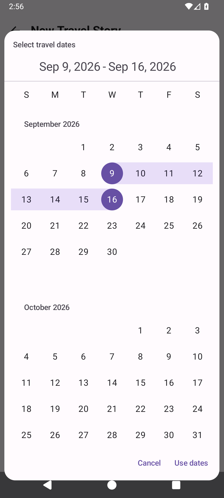

# My Travel Diary 3D — Installation & user guide

[← App overview](../README.en.md) · [한국어](INSTALLATION_3D.md) · **English**

Import a trip, watch it on the map, and save a video. The steps below use the button names shown in the app; some labels currently appear in Korean.

## 1. Install the app

You need an Android phone or tablet running **Android 8.0 or later**. The current version is **1.0.0-rc12 (prerelease)**.

| Device | Installation file |
| --- | --- |
| Most recent Android phones and tablets, including Galaxy S23 Ultra | [Recommended APK — about 56 MB](https://github.com/HyeokjaeKwon26/My-Travel-Diary-3D/releases/download/v1.0.0-rc12/My-Travel-Diary-3D-1.0.0-rc12-arm64.apk) |
| If the recommended file is incompatible with your device | [Universal APK — about 89 MB](https://github.com/HyeokjaeKwon26/My-Travel-Diary-3D/releases/download/v1.0.0-rc12/My-Travel-Diary-3D-1.0.0-rc12.apk) |

An APK is an Android app installation file. Download **one of these files**, not both.

1. Open the download link on your phone.
2. Open the downloaded file. If Android asks you to allow installation from that browser or file app, follow its prompts.
3. When installation finishes, open **My Travel Diary 3D**.

If you already use the 3D edition, **open the new APK to update without uninstalling**. Uninstalling removes trips stored in the app. The original 2D edition is a separate app; its trips are not automatically transferred.

## 2. Try the demo without personal data

Tap **+ New Travel Story → Try Grand Canyon 3D • illustrative route** to see 3D terrain and an animated car without importing a personal Timeline file.

The demo route was created to show the features. It is not a real traveler's GPS track or a route for road navigation.

## 3. Create your own trip

Prepare a **JSON file exported from Google Maps Timeline** and the **photos from that trip on your phone**. The app imports existing journey records; photos alone do not create a new travel route.

1. Tap **+ New Travel Story** on the home screen.
2. When asked, allow access to the photos you want to include. If you allow only selected photos, only those will be available.
3. Tap **Choose Timeline JSON File** and select your file.
4. Enter a name under **Trip Title (Optional)**, such as `Autumn in New England`.
5. Tap **Select dates**, select your first and last travel days on the calendar, and tap **Use dates**.
6. Tap **Reconstruct Travel Story**. Progress and estimated time remaining appear while the trip is prepared. The time needed depends on the amount of data and your device.

*Example date-selection screen. Calendar language and date formatting may depend on device settings.*

## 4. Play your journey

Open a trip card and tap **▶ inside the map**.

Controls fade away after about three seconds without interaction during playback. **Tap the map once to show them again**; the trip keeps playing. Controls stay visible while paused or while you hold the seek bar. Seeking during playback resumes from the chosen position; seeking while paused keeps it paused. Wide landscape screens use a single row of controls. Accessibility settings may extend the time controls remain visible.

| What you want to do | Control |
| --- | --- |
| Pause or resume | Play/pause button |
| Start again | Circular arrow button |
| Jump to a scene | Move the seek bar |
| Check playback time | Read `elapsed / total` beside or above the seek bar |
| Play slower or faster | `1×` speed button |
| Turn music on or off | Music-note button |
| See a larger map | Fullscreen button on the playback controls; rotate for landscape |
| Change map or terrain options | Gear beside the trip title: **Map settings** |

North stays at the top while the map follows the current location. The scale adjusts automatically to show the route, so pinch-to-zoom is not needed. The actual date and `Day N` stay visible during playback.

When a photo taken during travel appears, the route and character briefly pause, then continue. Photos keep their original proportions.

## 5. Personalize photos and organize trips

**Feature a favorite photo:** Tap a photo in the diary and choose **Use as Representative Photo**. Your manual choices take priority over automatic selection.

**Refresh automatic selection:** Use **사진 다시 고르기** (“Choose photos again”) near the top of the trip and confirm. Manually selected representative photos are kept. Normally, the app reuses saved selections instead of analyzing every photo each time you open a trip. Older trips may need one preparation pass after updating.

New gallery photos are not automatically imported into an existing trip. “Choose photos again” works with photos already linked to that trip.

**Sort your trips:** On the home screen, choose name, creation order, or travel date in the sorting menu. Use the adjacent ascending/descending button to reverse the order.

**방문 기록 N회** on a trip card means “N visit records,” including repeated visits to the same place. **인근** means “nearby”: the name comes from a region near the recorded coordinates, not a confirmed visit to that exact city or attraction.

## 6. Save and share a video

1. Tap **▶ to the right of the trip title** to open **Export Travel Video**.
2. Choose a length: **Short Story** for a brief summary, **Standard Story** for highlights, or **Full Story** for more detail. Each option shows an estimated video duration.
3. Choose **Portrait 9:16** or **Landscape 16:9**.
4. Choose **720p / 1080p** and whether to include background music. Start with Standard Story and 720p. Devices that cannot support 1080p export may fall back to 720p.
5. Tap **Create Travel Video** and wait for it to finish.
6. Use **Play Preview** to check it, then **Save Video** to save to your gallery or **Share** to share it.

The finished MP4 is a separate video file. You can watch it in fullscreen or landscape inside the app. Rotating your screen does not change the video's encoded aspect ratio; to turn a portrait video into a landscape video, select landscape and create it again.

The privacy option generalizes place names. It does not hide routes, map labels, or addresses visible inside photos. Check the preview before sharing.

## 7. Back up and restore trips

Tap **▶ beside the trip title → Back up this journey** to save a backup. To restore it, choose **Restore** on the home screen and select that file.

**Backups do not contain original photos.** They store trip records and photo references. Keep original photos and Timeline files separately. Backup is not a tool for moving photos to another phone. Before uninstalling the app, back up important journeys and save any finished videos you want to keep.

## Questions and troubleshooting

### Will photos remain in the trip after I delete them?

The app saves photo selections, not archival copies of the images. Deleting a gallery original makes that photo unavailable to the trip. An MP4 already saved with **Save Video** remains playable without the original photos.

### A photo is missing

Check photo permissions, whether the original is still on your phone, and the trip dates. If you granted access to only selected photos, allow access to the missing ones too. If automatic selection misses a favorite, choose it manually as a representative photo.

### Part of the map or video looks less detailed

New areas need internet access for detailed maps and terrain. Open the trip on Wi-Fi and check the map settings using the gear beside the title. Street detail can also use mobile data.

Video creation uses detailed maps already prepared on the phone. Where detail is missing or has been removed from the cache, the basic map may appear. There is no feature to download all detailed maps for the entire trip at once.

### The route is dotted or does not match the road

Missing location records are connected with estimated dotted lines. This is a travel-memory app, not navigation or an exact road-route reconstruction tool. Bouncy character movement and some flight heights are artistic effects.

### Playback or video creation is slow

Try 720p and a shorter video, or switch to 2D in map settings. Long trips and large photo collections take more time to prepare. This is a prerelease; sustained playback performance has not been verified on every device.

If the problem continues, [send feedback](https://github.com/HyeokjaeKwon26/My-Travel-Diary-3D/issues) with **your device name, app version, and steps to reproduce it**. Hide home addresses or personal photos you do not want to make public before attaching screenshots.

---

[App overview](../README.en.md) · [Downloads](https://github.com/HyeokjaeKwon26/My-Travel-Diary-3D/releases) · [Disclaimer](../DISCLAIMER.md#english) · [Privacy](PRIVACY_3D.md) · [Developer guide](DEVELOPMENT.md)
